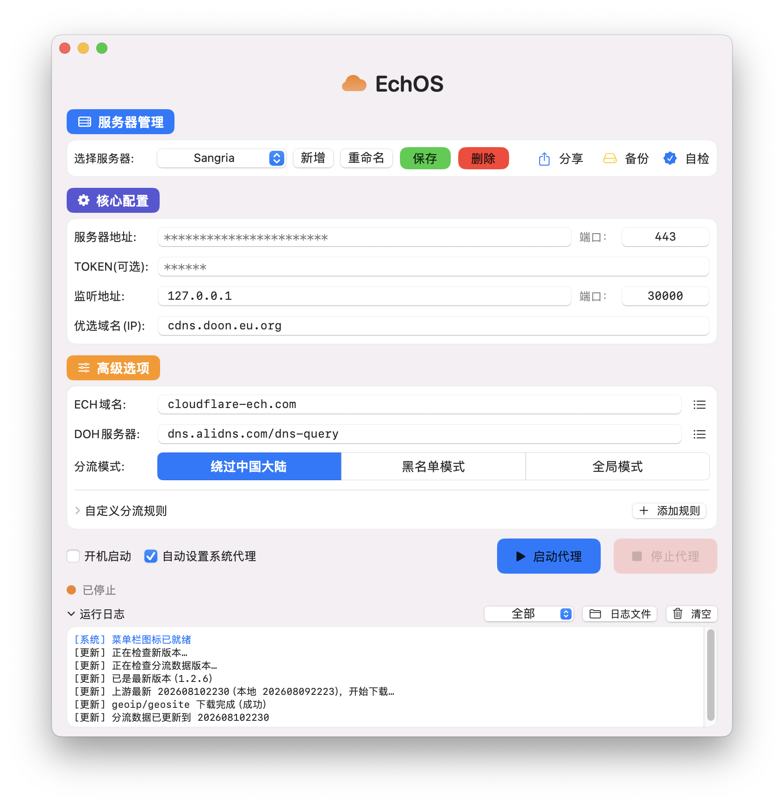
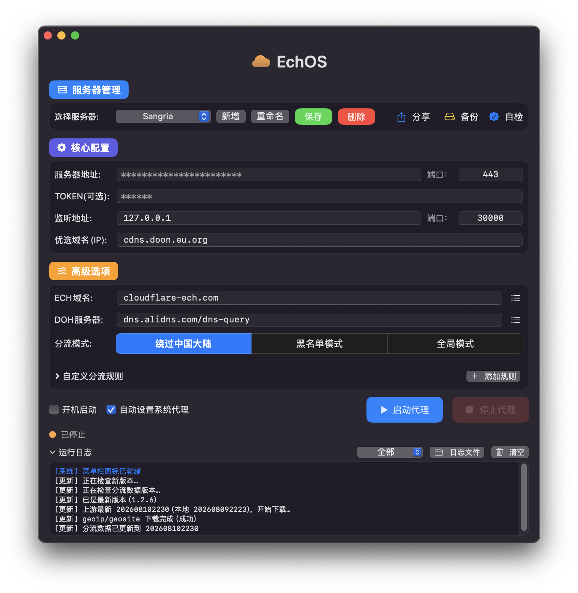

# EchOS-Win

基于 **ECH（Encrypted Client Hello）** 的加密代理客户端，**Windows 桌面应用**。

**Go 内核 + Electron 界面**，一个 App 完成代理全部功能，不需要额外装 v2rayN / ClashX。
服务端跑在 Cloudflare Workers 上，免费额度足够个人日常使用。
> 上游源仓库：**[https://github.com/nerder-real/EchOS/](https://github.com/nerder-real/EchOS/)**（macOS 原版，本项目由它移植而来）

---

## 界面预览

浅色 / 深色自动适配，跟随 Windows 系统深浅色自动切换，无需手动设置：

| 浅色 | 深色 |
|---|---|
|  |  |

> 界面风格示意（截图来自 macOS 原版，Windows 版界面同风格）。多服务器管理、核心配置、分流模式、运行日志都在一个窗口里。

---

## 功能特性

- **ECH 加密隧道** — 基于 TLS ECH 的代理协议，抗 DPI 检测（Go 内核原生实现）
- **SOCKS5 + HTTP 双协议本地代理** — 自动分配端口，HTTP 端口自动 +1
- **系统代理一键接管** — 通过注册表 + WinINET 接管系统代理（HTTP），停止/退出时自动还原。接管前自动备份用户原始设置（含 PAC），App 崩溃或被强杀后，下次启动检测到残留接管状态会自动还原，不会让流量打到无人监听的旧端口
- **三种分流模式** — 绕过中国大陆 / 黑名单 / 全局；分流模式是全局参数，无论选中哪台服务器都遵从同一个，切换**立即保存生效**。内核自带分流引擎（geoip / geosite），不依赖 v2rayN
- **多服务器管理** — 新增 / 编辑 / 删除 / 导入 / 导出；参数不完整时拒绝保存；**运行中切换服务器**：主窗口下拉直接切换，自动重启代理生效
- **自定义分流规则** — 域名、IP/网段、网站分类（geosite / geoip）三类规则，动作可选直连 / 走代理 / 拦截；自定义规则优先于分流模式自带规则，顺序匹配先命中先生效
- **隧道兜底（防黑洞卡死）** — 客户端已向目标发过数据、服务端却长时间从未返回时（典型是 Worker 兼容日期不对导致出站数据不转发）自动断开并点名提示，连接不再永久挂起
- **自动检查更新** — 启动时后台静默检查 GitHub Releases；发现新版本用独立弹窗提示并打开下载页（便携版 / 安装包）；分流数据（geoip / geosite）随构建自动打包进安装包
- **服务器分享** — 将已保存的服务器导出成 `.json` 文件，或从分享文件一键导入；导入只接收参数完整的服务器，服务地址 + 端口相同的重复项自动跳过，名称撞车自动加序号
- **连通性自检** — 通过本地代理探测 gstatic / cloudflare 等站点连通性（任一通过即隧道正常），一键确认代理可用
- **托盘常驻** — 关闭窗口隐藏到系统托盘，代理继续运行；托盘菜单可显示窗口、启动/停止代理、切换分流模式、开关开机自启
- **开机自启** — 写入注册表 `Run` 键，登录 Windows 后自动启动
- **深浅色自动适配** — 跟随 Windows 系统深浅色自动切换
- **运行日志** — 界面日志面板（折叠 / 级别过滤 / 日志文件 / 清空），按级别着色（错误红、警告橙、自检绿），支持一键打开日志目录
- **自检记录** — 自检结论走独立通道，日志级别选「自检记录」单独查看
- **状态灯与自检状态** — 状态圆点随运行 / 自检结果变色（待检测 / 检测中 / 通过 / 失败），状态栏文字显示「运行中 · 本地端口 · 已接管系统代理」
- **主界面直接编辑（1:1 复刻 macOS 版布局）** — 标题栏、服务器管理、核心配置、高级选项、操作行、日志面板六大区域；服务器地址 / TOKEN 掩码显示（聚焦才显示）；运行中禁用新增 / 重命名 / 保存 / 删除
- **未保存改动保护** — 编辑后「保存」按钮橙色高亮，切换服务器 / 启动代理前拦截提示
- **系统托盘菜单** — 状态行（● 已接管 / ○ 未接管）、开启/关闭代理、选择服务器（运行中切换自动重启代理）、检查更新、显示应用、退出
- **整配置备份 / 还原** — 本地文件（.json）或 WebDAV 两种方式；WebDAV 密码存系统安全存储（DPAPI），只备份已保存的服务器，还原前校验参数完整性
- **端口占用一键处理** — 启动时若监听端口被占用，弹窗标明占用进程（名称 + PID），可一键强制结束并自动启动，或自动换用空闲端口
- **启动失败智能提示** — 根据内核日志分类提示：TOKEN 与服务器端不一致 / 服务器连接失败 / 服务地址或优选 IP 解析失败
- **DoH / ECH 域名预设** — 内置阿里 / 腾讯国密 / 360 / OpenDNS / Quad9 等 10 个 DoH 与 11 个 ECH 域名，下拉即选，也可手动输入
- **敏感字段掩码** — 服务器地址 / TOKEN 输入框失焦后以圆点遮挡，聚焦才显示


---

## 系统要求

- Windows 10 / 11（x64）
- 需 WebView2 运行时（Windows 10/11 通常已自带；缺失时 Electron 会提示安装）

---

## 快速开始

### 使用安装包

1. 下载 `EchOS-Win-<版本>-x64-setup.exe` 安装，或直接运行 `EchOS-Win-<版本>-x64.exe` 便携版（免安装）
2. 首次运行，在「服务器管理」里新增一台服务器，填好服务地址 / 端口 / TOKEN
3. 选好分流模式 → 点「启动代理」→ 打开「接管系统代理」开关
4. 关闭窗口 = 隐藏到托盘，代理继续在后台运行

> 无代码签名，Windows SmartScreen 首次运行可能提示「更多信息 → 仍要运行」。

### 配置项

| 字段 | 说明 | 示例 |
|---|---|---|
| 服务地址 | Workers 域名（不含协议头） | `xxx.workers.dev` |
| 服务端口 | 连接端口 | `443` |
| 监听地址 | 本地代理地址 | `127.0.0.1` |
| 监听端口 | SOCKS5 端口，HTTP 自动 +1 | `30000` |
| 优选IP(域名) | Cloudflare 优选 IP，逗号分隔 | `104.16.158.132` |
| ECH域名 | ECH 公钥查询域名 | `cloudflare-ech.com` |
| DOH服务器 | ECH 公钥查询 DNS | `dns.alidns.com/dns-query` |
| TOKEN | 可选，与服务端 Workers 的 `TOKEN` 环境变量一致 | |

> **ECH域名 / DOH服务器 已内置常用选项**：ECH 域名含 `cloudflare-ech.com`、`crypto.cloudflare.com` 等；
> DOH 含阿里 DoH、腾讯国密 DoH、360 DoH、OpenDNS、Quad9 等国内外共 10 个，直接选即可，无需手动去查。
> 感谢 [@CM 大佬](https://t.me/CMLiussss)（优选 IP 方案与其维护的 ProxyIP 同源）整理。

---

## Cloudflare 部署（服务端）

服务端是一个 Cloudflare Worker，仓库根目录的 `Worker-ECH.js` 就是完整代码。仓库已带 `wrangler.toml` 和 `deploy-worker.sh`，两种方式任选：

> <span style="color:red">**⚠️ 必读：Worker「兼容日期」必须设为 26 年之前的任意日期**（26 年 4 月群友反馈：用 26 年内的日期部署后隧道无法使用）。</span>
>
> 设置位置：Worker 项目 → **Settings（设置）→ Running（运行时）→ Compatibility Date（兼容日期）** 改成 `Sep 15, 2025`。
>
> 命令行部署（方式一）已由 `wrangler.toml` 的 `compatibility_date = "2025-09-15"` 自动带上；网页部署（方式二）需手动设置。

### 方式一：命令行一键部署（推荐）

```bash
# 安装 wrangler（需要 Node.js 环境）
npm install -g wrangler

# 首次需要登录 Cloudflare 账号（会打开浏览器）
wrangler login

# 部署；需要鉴权时带上 TOKEN（值自定义，一长串随机字符）
# macOS / Linux / Git Bash：
TOKEN=你的密钥 ./deploy-worker.sh
# Windows（cmd）：
set TOKEN=你的密钥 && deploy-worker.bat
```

`wrangler.toml` 里的 `name` 就是 Worker 名称，部署前可自行修改。

### 方式二：网页 Dashboard 手动部署

1. 打开 [Cloudflare Dashboard](https://dash.cloudflare.com) → **Workers & Pages** → **Create** → 选 **Workers**
2. 名称随意，创建后点 **Edit code**，用 `Worker-ECH.js` 的内容覆盖默认代码，保存
3. <span style="color:red">**设置兼容日期**：**Settings（设置）→ Running（运行时）→ Compatibility Date（兼容日期）** 改成 `Sep 15, 2025`（⚠️ 不设则隧道数据不通，现象是「能连上但打不开网站」）</span>
4. 可选：**Settings → Variables and Secrets → Add**，加一个环境变量 `TOKEN`
   - 设了 TOKEN 后，客户端必须填相同的 TOKEN 才能连上
   - 不设 TOKEN 就是全公开，任何人都能拿你的 Worker 当代理，**强烈建议设置**
5. 部署后得到一个 `https://<你的名称>.workers.dev` 地址，填进客户端的「服务地址」

> 无需绑定域名、无需支付。Worker 免费计划每天 10 万请求，个人使用绰绰有余。

---

## 从源码构建（Windows）

需要 **Go 1.22+** 和 **Node.js 18+**（含 npm）。

```powershell
# 1) 下载分流规则数据（geoip.dat / geosite.dat，约 28MB 二进制，不进仓库）
.\fetch-geodata.bat          # Windows 原生脚本；已装 Git Bash 也可用 bash fetch-geodata.sh

# 2) 一键构建：编译 Go 内核 + 打包 Electron 安装包
.\build.ps1

# 产物：
#   build/x-tunnel.exe                        Go 内核
#   build/installer/EchOS-Win-<版本>-x64.exe        免安装便携版
#   build/installer/EchOS-Win-<版本>-x64-setup.exe  NSIS 安装包
```

> 只想编译内核：`.\build.ps1 -KernelOnly`；依赖已装好、跳过 npm install：`.\build.ps1 -SkipNpm`。
> `fetch-geodata.sh` 下载过之后会跳过；想强制更新最新数据，删掉 `assets/geoip.dat`
> 和 `assets/geosite.dat` 再跑一次即可。

---

## 项目结构

```
EchOS-Win/
├── Worker-ECH.js          # Cloudflare Worker 服务端（完整代码）
├── wrangler.toml          # Worker 配置（名称、入口）
├── deploy-worker.sh       # 一键部署脚本（wrangler CLI，macOS/Linux）
├── deploy-worker.bat      # 一键部署脚本（wrangler CLI，Windows）
├── fetch-geodata.bat      # 下载分流数据 geoip.dat / geosite.dat（Windows）
├── CHANGELOG.md           # 更新日志（发版时自动作为 Release 正文）
├── fetch-geodata.sh       # 下载分流数据 geoip.dat / geosite.dat
├── build.ps1              # Windows 一键构建脚本（内核 + Electron 打包）
├── build.sh               # macOS 构建脚本（gui-macos/ 旧版界面）
├── make-dmg.sh            # macOS DMG 打包脚本
├── core/                  # Go 内核 (x-tunnel)，跨平台
│   ├── x-tunnel.go        # 入口：参数解析、端口监听、隧道调度
│   ├── simple_ws.go       # WebSocket 隧道（简单协议）
│   ├── route_*.go         # 分流规则（geosite / geoip）
│   └── tun_*.go           # TUN 相关（当前平台均未启用）
├── gui/                   # Windows 界面（Electron）
│   ├── main.js            # 主进程：内核生命周期、系统代理、托盘、开机自启
│   ├── preload.js         # 安全桥接
│   ├── renderer/          # 前端页面（HTML/CSS/JS，跟随系统深浅色）
│   └── package.json       # Electron 配置与打包
├── gui-macos/             # 原 macOS 界面（SwiftUI，保留参考）
├── assets/                # 分流数据（构建前下载）、图标源文件
├── screenshot/            # 界面截图（浅色/深色）
└── .github/workflows/
    ├── ci.yml             # push / PR 自动构建并上传构建产物
    └── release.yml        # 打标签自动构建并发布（macOS DMG + Windows 安装包 + SHA256）
```

---

## 分发说明

- 用户配置保存在 `%APPDATA%\EchOS-Win\config.json`（服务器、分流模式、设置）；日志在 `%APPDATA%\EchOS-Win\logs\`
- 首次启动不会预置任何服务器，请在「服务器管理」里新增
- 关闭主窗口 = 隐藏到系统托盘，代理继续运行；托盘右键 → 退出才完全退出
- 退出 / 崩溃时自动还原系统代理（基于启动前备份的原始设置）
- 发版：推 `v*` 标签自动触发 `.github/workflows/release.yml`，CI 构建 Windows 安装包与 macOS DMG 并发布 GitHub Release（正文取 `CHANGELOG.md` 对应版本段落）

## 不传 GitHub 的文件

以下内容**不会**出现在 GitHub 仓库里（`.gitignore` 兜底）：

| 内容 | 原因 |
|---|---|
| `build/`（安装包、中间产物） | 编译产物，由 Actions 发版时自动生成 |
| 根目录 `EchOS-mac-*.dmg` | 本地 macOS 打包产物，不入库 |
| `assets/geoip.dat`、`assets/geosite.dat` | 约 28MB 二进制，上游开源数据，构建前用 `fetch-geodata.sh` 下载 |
| `gui/node_modules/` | npm 依赖，`npm install` 时生成 |
| `config.json`、`logs/` | 用户配置与日志（在用户目录，运行时生成） |

---

## 版本记录

| 版本 | 内容 |
|---|---|
| 1.2.7 | **Windows 版首发**：由 macOS 版（Go + SwiftUI）移植为 Windows 桌面应用（Go + Electron）。完整保留 ECH 加密隧道、SOCKS5/HTTP 本地代理、三种分流模式、系统代理接管/还原、多服务器管理与分享、连通性自检、托盘常驻、开机自启、深浅色适配、自动检查更新；Go 内核 Windows 原生编译（x-tunnel.exe），自带分流引擎，不依赖 v2rayN；`build.ps1` 一键构建 portable 便携版 + NSIS 安装包 |

---

## 开源说明

**EchOS-Win 是开源项目**，欢迎贡献与反馈：

- 本项目基于 [MIT 协议](LICENSE) 开源，可自由 Fork、修改、提交 Pull Request
- 使用中发现 Bug 或有功能建议，欢迎在 GitHub 仓库提交 Issue
- **仅供学习交流使用，请勿用于商业用途；请在下载后 24 小时内删除。**
- 请遵守所在地区的法律法规；ECH 是加密传输技术，本身无好坏之分，请勿用于任何非法用途
- `assets/geoip.dat`、`assets/geosite.dat` 为分流规则数据，遵循各自上游开源协议
- 本项目不提供任何可用的公共代理服务器，服务端需自行部署（见上文 Cloudflare 部署）
- 本地一键构建与打包见上文「从源码构建（Windows）」

---

## 致谢与来源说明
本项目由 macOS 版 [EchOS](https://github.com/nerder-real/EchOS/)（Go + SwiftUI）移植而来，
上游源仓库：**https://github.com/nerder-real/EchOS/**，在多位开源作者的工作基础上适配成 Windows 桌面应用（Go + Electron）。
特别感谢：

- **CCF 大佬**（[@CCF](https://t.me/JPCCF)）—— 客户端开发与整体方案设计，核心能力基于其开源项目 [CF_NAT](https://t.me/CF_NAT) 构建
- **byJoey 大佬** — 部分实现参考其开源项目 [ech-wk](https://github.com/byJoey/ech-wk)
- **CM 大佬**（[CMLiussss](https://t.me/CMLiussss)）—— 优选 IP 方案参考其维护的 ProxyIP 定制优化

让部署到 Cloudflare Workers 后的连接、分流与使用体验更加便捷。